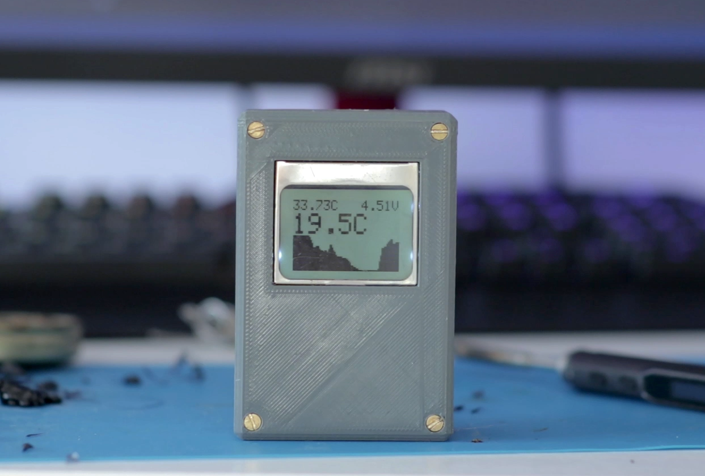
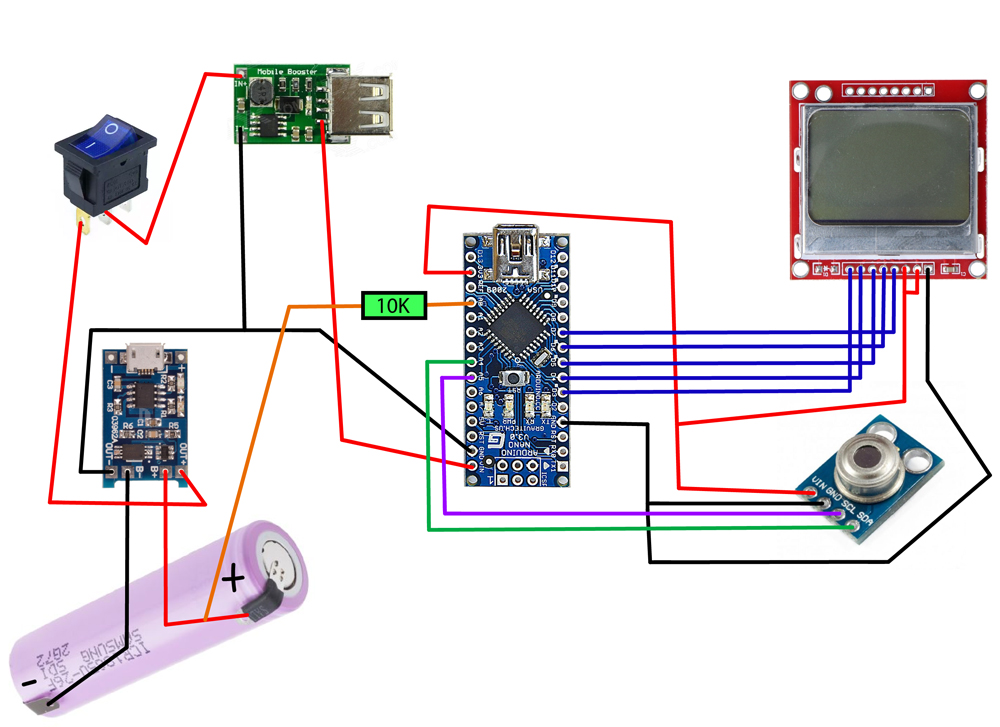

# Arduino pir thermometer
A code repository for [this video ](https://www.youtube.com/watch?v=8nltqt8UZlI)

## Parts list
|Module| URL |
|-------|------|
|  Arduino|[Arduino Nano](https://store.arduino.cc/arduino-nano)|
|  IR sensor|[MLX90614](https://www.aliexpress.com/item/32956921432.html?spm=a2g0o.productlist.0.0.32ee7f8evfB3dJ&algo_pvid=992d861c-c22d-42c4-956c-fad28f2c7e62&algo_expid=992d861c-c22d-42c4-956c-fad28f2c7e62-0&btsid=5739f604-d94f-4e93-be80-3dff29fe6e90&ws_ab_test=searchweb0_0,searchweb201602_3,searchweb201603_53)|
|  5V converter|DC-DC converter step-up [module](https://www.aliexpress.com/item/32883295719.html?spm=a2g0o.productlist.0.0.7d5416ebQql77m&algo_pvid=395316b4-9d09-486f-8a70-6979fdf2ed95&algo_expid=395316b4-9d09-486f-8a70-6979fdf2ed95-7&btsid=b2399fe7-f498-4ef1-bea7-6482dc8acbc7&ws_ab_test=searchweb0_0,searchweb201602_3,searchweb201603_53) (0.9V~5V) to 5V|
|  Li-Po charger|[Li-Po USB Charger](https://www.aliexpress.com/item/33058722359.html?spm=a2g0o.productlist.0.0.744a147c4Bt05Y&algo_pvid=3d95286a-3490-4eee-8f4e-6aeba2c3ef11&algo_expid=3d95286a-3490-4eee-8f4e-6aeba2c3ef11-6&btsid=1c5d033c-a7eb-4b33-bf6d-333024580b74&ws_ab_test=searchweb0_0,searchweb201602_3,searchweb201603_53)|
|  LCD|[Nokia 5110 lcd screen](https://www.aliexpress.com/item/32614334972.html?spm=a2g0o.productlist.0.0.16437649OmVoFt&algo_pvid=abc403dd-a238-4a50-ae68-43a93e896cd7&algo_expid=abc403dd-a238-4a50-ae68-43a93e896cd7-3&btsid=45b18fb2-f72b-49f2-8fe4-fb4646294c45&ws_ab_test=searchweb0_0,searchweb201602_3,searchweb201603_53)|
|  Switch|[Power Switch](https://www.aliexpress.com/item/32840360301.html?spm=a2g0o.productlist.0.0.24c313ce0o1Bqr&algo_pvid=426c3ce4-da3f-4f1d-b391-94f6ba9c30db&algo_expid=426c3ce4-da3f-4f1d-b391-94f6ba9c30db-16&btsid=7bd1e1c8-1b34-469e-a41f-af980f0eb3e2&ws_ab_test=searchweb0_0,searchweb201602_3,searchweb201603_53)|

## Schematics
